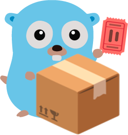

<div align="center">
  <a href="https://github.com/loommii/ShortURL"></a>
  <h1>ShortURL - 高性能短链接生成服务</h1>
  <p><em>基于 Go-Zero 构建的高性能 URL 缩址服务</em></p>
</div>

<div align="center">

[](LICENSE)
[](https://golang.org/)
[](https://github.com/zeromicro/go-zero)


</div>

---

## 📋 目录

- [概述](#概述)
- [功能特性](#功能特性)
- [架构设计](#架构设计)
- [安装部署](#安装部署)
- [配置说明](#配置说明)
- [API 文档](#api-文档)
- [部署方式](#部署方式)
- [开发指南](#开发指南)
- [贡献指南](#贡献指南)
- [许可证](#许可证)

## 概述

ShortURL 是一款基于 Go-Zero 微服务框架构建的高性能、可扩展的 URL 短链接生成服务。它提供了生成和重定向短链接的完整解决方案，并通过 Redis 缓存和 MySQL 持久化存储确保了卓越的性能和可靠性。

### 核心特点

- **高性能**: 优化的 Redis 缓存层，提供快速查询能力
- **可扩展**: 采用 Go-Zero 微服务架构设计
- **持久化存储**: MySQL 数据库存储长期 URL 映射关系
- **随机短码**: 安全的 6 位字母数字短链接标识符
- **并发安全**: 使用原子计数器实现线程安全操作

## 功能特性

- 🔗 **URL 缩址**: 将长 URL 转换为 6 位短标识符
- 🔄 **URL 重定向**: 从短链接无缝跳转到原始 URL
- 💾 **数据持久化**: URL 映射关系存储在 MySQL 数据库中
- ⚡ **缓存机制**: 基于 Redis 的缓存，提升访问性能
- 🛡️ **冲突处理**: 自动重试机制处理键冲突
- 📊 **健康检查**: 内置 ping 接口进行服务健康监控
- 🧮 **智能算法**: 62 字符字典配合随机化

## 架构设计

```
┌─────────────────┐    ┌──────────────────┐    ┌──────────────┐
│    HTTP 客户端   │    │                  │    │              │
│                 │───▶│   ShortURL API   │───▶│   MySQL DB   │
│                 │    │                  │    │              │
└─────────────────┘    └──────────────────┘    └──────────────┘
                            │     │
                            │     ▼
                            │   ┌─────────────┐
                            └──▶│   Redis     │
                                │  缓存层      │
                                └─────────────┘
```

### 组件说明

#### 服务层
- **Handler**: 管理 HTTP 路由和请求处理
- **Logic**: URL 缩址和重定向的核心业务逻辑
- **Model**: MySQL 操作的数据访问层
- **Service Context**: 依赖注入容器
- **Types**: 请求/响应数据结构定义

#### 数据层
- **MySQL**: URL 映射关系的持久化存储
- **Redis**: 快速键值查询的缓存层

#### 工具组件
- **Dictionary**: 自定义 62 字符编码算法
- **Configuration**: YAML 配置文件管理

## 安装部署

### 环境要求

- [Go](https://golang.org/doc/install) >= 1.22
- [MySQL](https://dev.mysql.com/downloads/) >= 5.7
- [Redis](https://redis.io/download) >= 6.0

### 快速开始

```bash
# 克隆仓库
git clone https://github.com/loommii/ShortURL.git
cd ShortURL

# 安装依赖
go mod tidy

# 配置环境
# 修改 etc/shorturl.yaml 中的 MySQL 和 Redis 设置
```

### 数据库初始化

```sql
CREATE DATABASE shortUrl CHARACTER SET utf8mb4 COLLATE utf8mb4_unicode_ci;

USE shortUrl;

CREATE TABLE `short_urls` (
  `id` bigint unsigned NOT NULL AUTO_INCREMENT,
  `short_url` varchar(255) NOT NULL COMMENT '短网址',
  `long_url` text NOT NULL COMMENT '长网址',
  `created_at` timestamp NOT NULL DEFAULT CURRENT_TIMESTAMP,
  `updated_at` timestamp NOT NULL DEFAULT CURRENT_TIMESTAMP ON UPDATE CURRENT_TIMESTAMP,
  PRIMARY KEY (`id`),
  UNIQUE KEY `uk_short_url` (`short_url`)
) ENGINE=InnoDB DEFAULT CHARSET=utf8mb4 COLLATE=utf8mb4_unicode_ci;
```

## 配置说明

编辑 `etc/shorturl.yaml` 文件配置服务：

```yaml
Name: shortUrl                    # 服务名称
Host: 0.0.0.0                     # 服务器主机地址
Port: 51743                       # 服务端口号
ServerName: http://127.0.0.1:51743  # 外部访问的服务器地址

# MySQL 配置
DataSource: shortUrl:password@tcp(127.0.0.1:3306)/shortUrl?parseTime=true

# Redis 配置
Redis:
  Host: 127.0.0.1:6379
  Type: node
  Pass: password
  Tls: false
```

## API 文档

### 生成短链接

- **接口地址**: `POST /register`
- **功能描述**: 创建短链接
- **请求参数**:

```json
{
  "longUrl": "https://www.example.com/very/long/url/to/shorten"
}
```

- **返回结果**:

```json
{
  "host": "http://127.0.0.1:51743",
  "shortKey": "aBcDeF",
  "shortUrl": "http://127.0.0.1:51743/s/aBcDeF"
}
```

### 短链接重定向

- **接口地址**: `GET /s/{shortKey}`
- **功能描述**: 重定向到原始 URL
- **路径参数**:
  - `{shortKey}`: 6 字符短链接标识符
- **返回结果**:

```json
{
  "longUrl": "https://www.example.com/very/long/url/to/shorten"
}
```

### 健康检查

- **接口地址**: `GET /ping`
- **功能描述**: 服务健康状态检查
- **返回结果**:

```json
{
  "message": "pong",
  "time": "2025-01-01T10:00:00Z"
}
```

### 使用示例

```bash
# 生成短链接
curl -X POST http://127.0.0.1:51743/register \
  -H "Content-Type: application/json" \
  -d '{"longUrl": "https://www.example.com/very/long/url/to/shorten"}'

# 返回:
# {
#   "host": "http://127.0.0.1:51743",
#   "shortKey": "aBcDeF",
#   "shortUrl": "http://127.0.0.1:51743/s/aBcDeF"
# }

# 访问短链接（浏览器访问会自动重定向）
curl http://127.0.0.1:51743/s/aBcDeF

# 检查服务健康状态
curl http://127.0.0.1:51743/ping
```

## 部署方式

### 开发模式运行

```bash
# 本地运行服务
go run shorturl.go -f etc/shorturl.yaml
```

### 生产环境部署

```bash
# 构建可执行文件
go build -o shorturl shorturl.go

# 运行服务
./shorturl -f etc/shorturl.yaml
```

### Docker 部署 (可选)

```dockerfile
FROM golang:1.22-alpine AS builder

WORKDIR /app
COPY . .
RUN go mod tidy
RUN go build -o shorturl shorturl.go

FROM alpine:latest
RUN apk --no-cache add ca-certificates
WORKDIR /root/
COPY --from=builder /app/shorturl .
COPY --from=builder /app/etc ./etc
EXPOSE 51743
CMD ["./shorturl", "-f", "etc/shorturl.yaml"]
```

服务启动后会在配置的主机和端口上监听请求。

## 开发指南

### 项目结构

```
ShortURL/
├── go.mod              # Go 模块文件
├── go.sum              # 依赖校验和
├── shorturl.go         # 主程序入口
├── ShortURL.api        # API 定义文件 (goctl)
├── etc/shorturl.yaml   # 配置文件
├── internal/           # 私有应用代码
│   ├── config/         # 配置结构定义
│   ├── handler/        # HTTP 处理器
│   ├── logic/          # 业务逻辑
│   ├── model/          # 数据模型和查询
│   ├── svc/            # 服务上下文
│   ├── types/          # 数据传输对象
│   └── utils/          # 工具函数
│       └── dictionary/ # 短链接生成算法
└── README.md
```

### URL 生成算法

服务使用自定义字典算法实现短链接生成：

1. 维护一个包含 62 个字符的随机化字典 (A-Z, a-z, 0-9)
2. 使用原子计数器生成连续 ID
3. 将计数器转换为使用随机化字典的 62 进制表示
4. 创建确保唯一性的 6 字符短链接标识符
5. 包含冲突检测和自动重试机制

## 贡献指南

欢迎贡献代码！您可以这样参与：

1. Fork 代码仓库
2. 创建功能分支 (`git checkout -b feature/新功能`)
3. 提交更改 (`git commit -am '添加新功能'`)
4. 推送到分支 (`git push origin feature/新功能`)
5. 开启一个 Pull Request

### 开发规范

- 遵循 Go 编码标准
- 编写清晰的提交信息
- 为新功能添加测试
- 更新 API 文档

## 许可证

本项目采用 MIT 许可证 - 详情请查看 [LICENSE](LICENSE) 文件。

---
<p align="center">Made with ❤️ using Go-Zero</p>